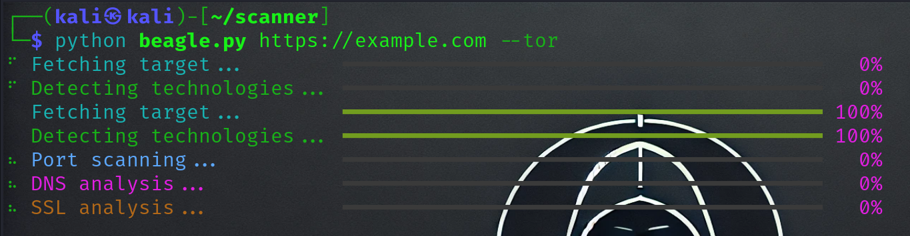

# **Beagle - Author CEO** 

<p align="center">
  
</p>

<p align="center">
  
  
  
  
  
  
  
  
</p>

## **🔍 Advanced Technology Detection & Reconnaissance Tool**

**Beagle** is a powerful CLI-based reconnaissance tool that goes beyond traditional scanners. It provides comprehensive technology detection, port scanning, service fingerprinting, and security analysis with beautiful real-time terminal output.

> **"See what others can't - Discover technologies, services, and security layers with unparalleled accuracy"**

<br>

## ⚠️ **DISCLAIMER**

**This tool is intended for educational purposes, security research, and authorized penetration testing only. The developers are not responsible for any misuse or damage caused by this program. Always ensure you have proper authorization before scanning any network or website.**

<br>

## 🚀 **Key Features**

### **🔧 Advanced Technology Detection**
- **Web Frameworks**: React, Angular, Vue.js, Django, Laravel, Express, etc.
- **CMS Detection**: WordPress, Joomla, Drupal, Magento with version analysis
- **Server Technologies**: Nginx, Apache, IIS with precise version detection
- **Security Stack**: WAFs, Firewalls, DDoS protection, Honeypot detection
- **Analytics & Marketing**: Google Analytics, Tag Managers, CRM platforms

### **🌐 Comprehensive Network Scanning**
- **Port Scanning**: TCP/UDP port discovery with service detection
- **Service Fingerprinting**: Accurate service and version identification
- **DNS Analysis**: Complete DNS records (A, AAAA, MX, TXT, NS, CNAME, SOA)
- **SSL/TLS Inspection**: Certificate details, validity, and security analysis

### **🔒 Security & Anonymity**
- **Tor Integration**: Anonymous scanning through Tor network with Socks5 Proxy
- **WAF Detection**: Cloudflare, Akamai, Imperva, and other WAF identification
- **Firewall Analysis**: ModSecurity, Wordfence, and other firewall detection
- **Honeypot Detection**: Identify potential deception systems

### **💫 Advanced Fingerprinting**
- **HTTP Headers Analysis**: Complete header inspection with versions
- **HTML/Meta Tags**: Meta tag analysis and technology signatures
- **JavaScript Analysis**: JS libraries, frameworks, and variable detection
- **CSS & Assets**: Stylesheet analysis and file path mapping
- **Behavioral Detection**: Dynamic JS execution and network behavior


### **🎨 Beautiful CLI Interface**
- **Real-time Progress**: Live progress bars and spinner animations
- **Rich Output**: Colorful tables, panels, and organized data display
- **Interactive Results**: Well-structured, easy-to-read scan results

<br>

## 📦 **Installation Guide**

### **System Requirements**
- Python 3.8 or higher
- Linux/macOS/Windows (Linux recommended for full functionality)

### **Basic Installation**

```bash
# Clone the repository
git clone https://github.com/ceodefender/beagle

# Navigate to the tool's directory
cd beagle

# Install Python requirements
pip install -r requirements.txt
```

### **Advanced Installation with Additional Tools**

```bash
# Install system dependencies (Linux/Debian)
sudo apt update
sudo apt install python3-pip nmap tor

# Install Python packages
pip install aiohttp rich beautifulsoup4 python-nmap dnspython requests lxml

# Start Tor service (for anonymous scanning)
sudo service tor start
```

### **Virtual Environment Installation (Recommended)**

```bash
# Create virtual environment
python3 -m venv beagle_env
source beagle_env/bin/activate  # Linux/macOS
# OR
beagle_env\Scripts\activate    # Windows

# Install dependencies
pip install -r requirements.txt
```

<br>

## 🛠 **Usage**

### **Basic Scan**
```bash
python beagle.py https://example.com
```

### **Anonymous Scan with Tor**
```bash
python beagle.py https://example.com --tor
```

### **Custom Port Scanning**
```bash
python beagle.py https://example.com --ports 80,443,8080,8443,22,21
```

### **Advanced Scan with Extended Timeout**
```bash
python beagle.py https://example.com --tor --timeout 60 --ports 1-1000
```

### **Full Command Reference**
```bash
usage: beagle.py [-h] [--tor] [--timeout TIMEOUT] [--ports PORTS] target

Beagle - Advanced Technology Detection Tool

positional arguments:
  target               Target URL or domain

optional arguments:
  -h, --help          show this help message and exit
  --tor               Use Tor for anonymity
  --timeout TIMEOUT   Request timeout in seconds
  --ports PORTS       Custom ports to scan (comma-separated)
```

<br>

## 📋 **Output Sections**

Beagle provides comprehensive output in these categories:

1. **🎯 Target Information** - Basic target details and scan metadata
2. **🔧 Technologies Detected** - Frameworks, CMS, servers with versions
3. **🔍 Port Scan Results** - Open/closed ports with services and versions
4. **🌐 DNS Analysis** - Complete DNS record analysis
5. **🔒 SSL Certificate** - TLS/SSL certificate details and validity
6. **📋 HTTP Headers** - Response headers and security headers
7. **🛡️ Security Analysis** - WAF, firewall, and protection detection

<br>


```

<br>

## 📊 **Detection Capabilities**

### **Technology Categories**
- **Web Frameworks** (50+ frameworks)
- **Content Management Systems** (20+ CMS platforms)
- **Web Servers** (10+ server technologies)
- **Programming Languages** (15+ languages)
- **Database Systems** (8+ databases)
- **Caching Systems** (5+ caching technologies)
- **CDN Providers** (15+ CDN services)
- **Security Technologies** (25+ security solutions)

### **Security Detection**
- **Web Application Firewalls** (Cloudflare, Akamai, Imperva, etc.)
- **Network Firewalls** (Various enterprise solutions)
- **DDoS Protection** (Multiple protection services)
- **Honeypot Systems** (Deception technology detection)
- **SIEM Solutions** (Security information systems)
- **SOC Platforms** (Security operations centers)

<br>

## 🎯 **Example Output**

```bash
🐕 Beagle - Author CEO
Advanced Technology & Security Detection Tool

📡 Target Information
┌──────────────┬────────────────────────────┐
│ Property     │ Value                      │
├──────────────┼────────────────────────────┤
│ Target       │ https://example.com        │
│ Scan Time    │ 2024-01-15T10:30:45.123Z   │
│ Status Code  │ 200                        │
└──────────────┴────────────────────────────┘

🔧 Technologies Detected
┌──────────────┬────────────┬─────────┬────────────┬────────────┐
│ Technology   │ Type       │ Version │ Confidence │ Source     │
├──────────────┼────────────┼─────────┼────────────┼────────────┤
│ Nginx        │ servers    │ 1.18.0  │ high       │ header     │
│ React        │ frameworks │ 18.2.0  │ medium     │ content    │
│ WordPress    │ cms        │ 6.3.1   │ high       │ meta       │
│ Cloudflare   │ security   │ unknown │ high       │ header     │
└──────────────┴────────────┴─────────┴────────────┴────────────┘
```

<br>

## 🔧 **Advanced Configuration**

### **Custom Signatures**
You can extend detection capabilities by modifying signature files in the `signatures/` directory:

```json
{
  "new_technology": {
    "patterns": ["custom-pattern-{{version}}"],
    "headers": ["x-custom-header"],
    "files": ["custom-file.js"],
    "meta": ["generator"]
  }
}
```

### **Output Formats**
Beagle supports multiple output formats (JSON, HTML reports - coming soon):

```bash
# Save results to JSON
python beagle.py https://example.com --output results.json
```

<br>

## 🤝 **Contributing**

We welcome contributions! Please feel free to submit pull requests, report bugs, or suggest new features.

### **Development Setup**
```bash
git clone https://github.com/ceodefender/beagle
cd beagle
pip install -r requirements-dev.txt  # Development dependencies
```

### **Areas for Contribution**
- New technology signatures
- Additional detection methods
- Performance improvements
- Output format enhancements
- Documentation improvements

<br>

## 🐛 **Troubleshooting**

### **Common Issues**

**Tor Connection Failed:**
```bash
# Start Tor service
sudo service tor start
# OR
sudo systemctl start tor
```

**Permission Errors (Port Scanning):**
```bash
# Run with sudo for SYN scans
sudo python beagle.py https://example.com
```

**Missing Dependencies:**
```bash
# Reinstall requirements
pip install --force-reinstall -r requirements.txt
```

<br>

## 📄 **License**

This project is licensed under the **PROPRIETARY LICENSE - STRICT PROTECTION** - see the [LICENSE](LICENSE) file for details.

<br>

## 🙏 **Acknowledgements**

- **Rich** - For beautiful terminal formatting
- **Python-Nmap** - For port scanning capabilities
- **aiohttp** - For asynchronous HTTP requests
- **BeautifulSoup** - For HTML parsing
- **dnspython** - For DNS analysis

<br>

## 📞 **Support**

If you encounter any issues or have questions:

1. Check the [Issues](https://github.com/ceodefender/beagle/issues) page
2. Create a new issue with detailed description
3. Provide scan output and error messages

<br>

---

## <p align="center">**MADE WITH ❤️ BY AUTHOR CEO**</p>

<p align="center">
  <strong>Discover More. Stay Secure. Beagle - Your Digital Bloodhound.</strong>
</p>

<p align="center">
  
  
  
</p>

